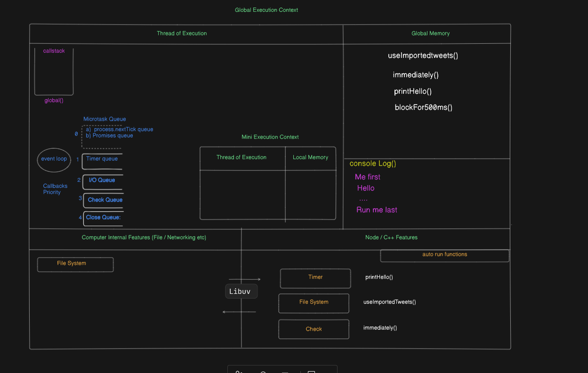
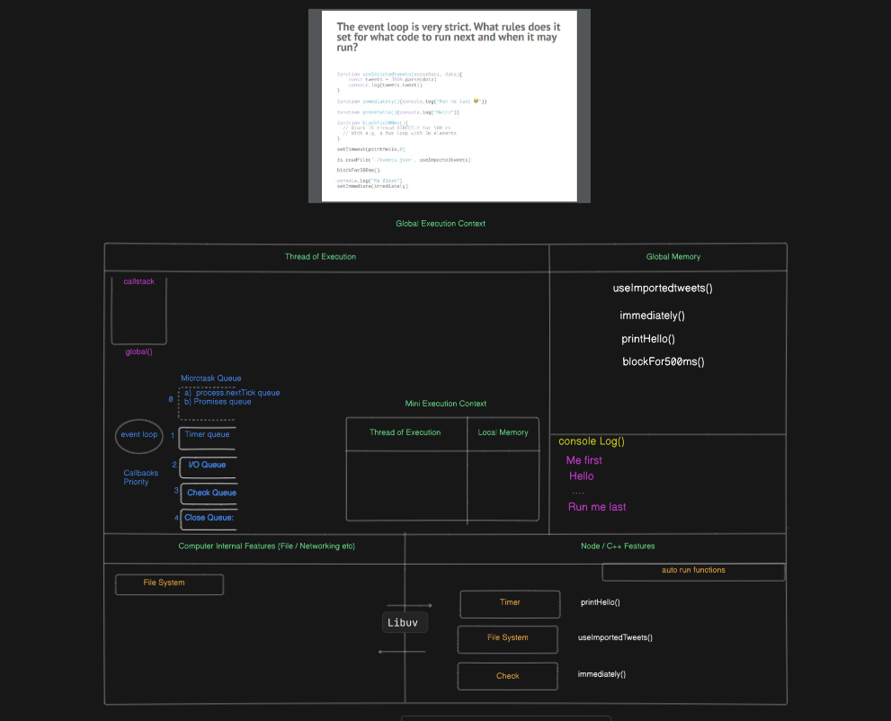
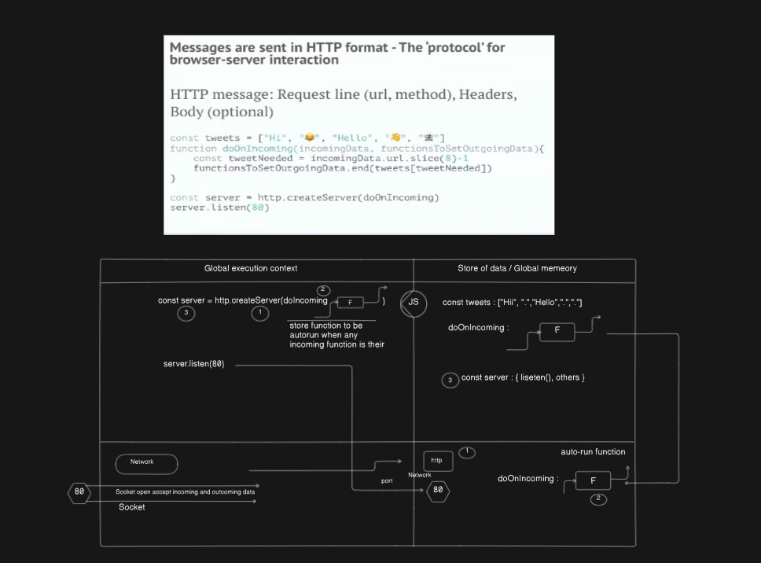

# Node.js Under the Hood

## Architecture Overview

Node.js combines several key technologies to enable server-side JavaScript execution:

### Core Components

1. **V8 Engine**
    - Google's open-source JavaScript engine
    - Compiles JavaScript to native machine code
    - Handles memory allocation and garbage collection
    - Provides built-in data structures and types

2. **Libuv**
    - Cross-platform I/O operations library
    - Manages event loop implementation
    - Handles thread pool operations
    - Provides async I/O operations for:
      - File system
      - Networking
      - DNS operations
      - System events

3. **Node.js Core APIs**
    - Built-in modules (http, fs, path, etc.)
    - JavaScript wrapper for native functionalities
    - Standardized interfaces for common operations
    - Extension points for native addons

### Event Loop Deep Dive

The event loop phases in order:

1. Timers (setTimeout/setInterval)
2. Pending callbacks
3. Idle/Prepare
4. Poll
5. Check (setImmediate)
6. Close callbacks

### Worker Threads

- Parallel JavaScript execution
- Shared memory & messaging
- Ideal for CPU-intensive tasks
- Built-in thread pool management

## Performance Considerations

- Single-threaded main event loop
- Non-blocking I/O operations
- Async programming patterns
- Event-driven architecture benefits
- Worker threads for CPU-bound tasks

## Best Practices

1. Avoid blocking the event loop
2. Use async/await for better readability
3. Implement proper error handling
4. Leverage worker threads for CPU-intensive tasks
5. Monitor memory usage and leaks

> Note: Understanding these internals helps in writing more efficient Node.js applications.

This diagram illustrates the core components of Node.js architecture and how they interact with each other.

## Key Components Shown

1. V8 Engine - JavaScript execution
2. Libuv - Event loop and async I/O
3. Node.js Core APIs
4. Event Loop Phases
5. Worker Threads
