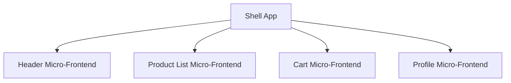

# Micro-Frontend Architecture

Micro-frontend architecture is an approach to developing web applications where a single application is composed of multiple smaller, independently deployable front-end applications. Each team can own a feature end-to-end, enabling scalable and maintainable development.

---

## What is Micro-Frontend?

Micro-frontends extend the concept of microservices to the frontend. Instead of building a monolithic frontend, the UI is split into semi-independent "micro-apps" working loosely together.

---

## Why Use Micro-Frontends?

- **Scalability:** Multiple teams can work independently on different features.
- **Autonomous Deployments:** Each micro-frontend can be deployed independently.
- **Technology Agnostic:** Teams can use different frameworks (React, Vue, Angular, etc.).
- **Resilience:** Failures in one micro-frontend do not break the entire app.
- **Incremental Upgrades:** Migrate or rewrite parts of the frontend without a full rewrite.

---

## When to Use Micro-Frontends?

- Large teams working on a complex product.
- Need for independent deployments and releases.
- Multiple domains or business units in a single product.
- Gradual migration from legacy systems.

---

## How to Implement Micro-Frontends?

### 1. **Composition Techniques**

- **Client-side Composition:** Use JavaScript to load micro-frontends in the browser (e.g., Single-SPA, Module Federation).
- **Server-side Composition:** Assemble micro-frontends on the server before sending to the client.
- **Edge-side Composition:** Use CDN or edge servers to compose micro-frontends.

### 2. **Communication**

- Use custom events, shared state, or pub/sub mechanisms for communication between micro-frontends.

### 3. **Routing**

- Use a central router or delegate routing to each micro-frontend.

### 4. **Deployment**

- Each micro-frontend is deployed independently, often as a separate artifact.

---

## Real-World Users

- **Spotify:** Uses micro-frontends for their web player.
- **IKEA:** Modularizes their e-commerce frontend.
- **DAZN:** Sports streaming platform with independently deployable features.
- **Zalando:** Early adopter, published [guidelines](https://martinfowler.com/articles/micro-frontends.html).

---

## Example System Design

- **Shell App:** Handles global layout, authentication, and routing.
- **Micro-Frontends:** Each responsible for a domain (e.g., product, cart).

---

## Best Practices

- Define clear contracts (APIs) between micro-frontends.
- Avoid tight coupling and shared global state.
- Use consistent UI/UX guidelines.
- Automate testing and deployments.
- Monitor performance and errors per micro-frontend.

---

## References

- [Micro-Frontends by Martin Fowler](https://martinfowler.com/articles/micro-frontends.html)
- [Single-SPA](https://single-spa.js.org/)
- [Webpack Module Federation](https://webpack.js.org/concepts/module-federation/)

---

*This document provides an overview of micro-frontend architecture, its benefits, use cases, implementation strategies, and real-world examples.*
